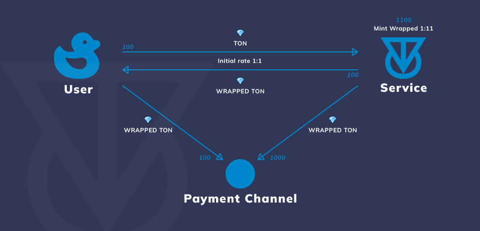

# TON Perpetual DEX

_Idea is to use Payment Channel_ as _user trades via service, with leverage trading usability._&#x20;


_With algorithmic-wrapped Ton (Jetton) in payment channel, to avoid liquidity problem (inability to pay)._

_And using TON as collateral for Leverage usage._

_\~temporary solution._


According to Low-level Scheme:

> Total amoun of sent TONs <mark style="color:orange;">**(or other assets)**</mark>

_Algorithmic-wrapped Ton (Jetton) in this scenario._

## Overview 

Deposit TON to smart contract _(<mark style="color:red;">unrealised, only as idea at the moment of hackathon!</mark>)_&#x20;

To mint wrapped Ton with exchange rate 1:1 at the moment.


Minting with 1:11 ratio, where 1:11 tokens goes to User, and 10:11 usage as liquidity for Payment Channel, between User and Service.


## Key Features of Service

* _Transparency_
* _DEX_
* _Perpetual futures_
* _Leverage usability_
* _Orderbook, neiter AMM structure - low slippage_

