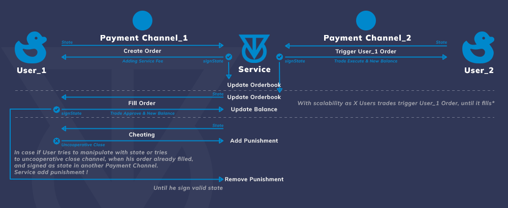

# Payment Channel

_Payment Channel usage as proof of trades._

## Use-case

* **For creating orders** - User create new state in Payment Channel, Service immediately sign state. In case if his order fills existing orders, Service update all this channels changes, adding Service fee maker/taker.
* **For closing orders** - User can close order, if it not filled.
* **Orders filling** - Service create new state in Payment Channel, when order filled partially or fully. User sign this state to update balance.


In case if User cheating and disagree with Service state, tries to undo bad trade as taker. When it already signed in another User Payment Channel as maker of order, Service punish his exchange rate between TON and wrapped Token at cheating amount, with makers signed states as proof, until that moment when User sign this states.&#x20;

_\~temporary solution._


* **Liquidations**  - Service create new state in Payment Channel, if order trigger liquidation price.


In case if User cheating and disagree with Service state, tries to avoid liquidation, or tries to uncooperative close Payment Channel -> Service punish his exchange rate to 0. by unical ID.

_\~temporary solution._


* **Take-profit/stop-loss** - Service create new state in Payment Channel, if order trigger price.
* **Transparency Deposit & Withdraw** - Only deposit as Payment Channel initialization and cooperative close as withdrawals in-chain. Other stuff goes off-chain using Payment Channel.

## **Deposit & Withdraw**

_Deposits as Payment Channel initialization and cooperative close as withdrawals._

_To realize partial Withdrawal of X amount, we can close channel, and immediately create new channel with new ID and (Returned amount - X) as initial balance from User._

_To deal with liquidations - we can change rate between wrapped asset an TON to 0, according to certain ID._

## Trigger functions

### Liquidations, Take-Profit & Stop-Loss functionality.

_Can be realized as new state from Service to User_

## Flud multiple states

_To avoid flud requests to user to signing last state, and update balance._

_We can ask user to sign, when he interact somehow creates new order, withdraw etc._

_To actualize balance in Payment Channel._

_And simply updating balance in UI, early (in each trade update)._

_For more conviement usability._
