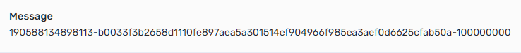

# Wrap/Unwrap

<mark style="color:red;">**Unrealised in hackathon stage!**</mark> __ only as idea.

_For example liquidity multiply = 10._\
_Wrapping X TON mints (10+1)\*X amount of Jetton, and 10\*X using as liquidity._

**S - Service.**

**U - User.**

## Calculations

### Main formula:

$$
x+y=k
$$

Where X is deposit amount, Y is liquidity amount, and K in minted amount.

When U deposits, and creates Payment Channel, with X amount as initial balance in state, S provide Y (10\*X) initial balance in state.

### 2nd formula:

$$
±Δx*(10+1)
$$

Rate between locked TON and total supply of wrapped TON should tends to 1:11, without considering fees and uncooperative closes.

_Δx is change between withdraw & deposit (cooperative close & init channel)._

_if Δx<0: S should burn (-Δx\*(10+1)) wrapped TON._

_if Δx>0: S should burn (Δx\*(10+1))+all returned wrapped TON from channel U\&S_

_to keep 1:11 rate._

## Example

For example at the moment Service used by 3 users: Alice, Bob and Carl.

Example does not include S fee, and misbehavior.

* Alice deposited 10 TONs and print 110 wrapped TONs.
* Bob deposited 15 TONs and print 165 wrapped TONs.
* Carl deposited 100 TONs and print 1100 wrapped TONs.


_TVL: 125 TONs, and total supply of wrapped TON: 1375. 1:11 ratio keeped._


All users initialize Payment Channel separately, at any moment and starts trading with each other.

| Status                                            | Alice | provide\_Liquidity | Bob | provide\_Liquidity | Carl | provide\_Liquidity |
| ------------------------------------------------- | ----- | ------------------ | --- | ------------------ | ---- | ------------------ |
| <mark style="color:green;">init Channel</mark>    | 10    | 100                | 15  | 150                | 100  | 1000               |
| _after some trades_                               | 5     | 105                | 16  | 149                | 104  | 996                |
| <mark style="color:red;">cooperative close</mark> | -     | -                  | 16  | 149                | 104  | 996                |
| <mark style="color:red;">cooperative close</mark> | -     | -                  | 16  | 149                | -    | -                  |

After some unsuccessful trades Alice decided to close channel and withdraw funds.


_Δx = 5-10 = -5 & f(Δx) = 55_


Alice got back 5 wrapped TONs, and S got back 105 wrapped TONs. Δx in that case < 0.

S should burn (-Δx\*(10+1)) wrapped TON, after Alice exchange wrapped TON back to TON.


_New TVL: 120 TONs, burned 55 wrapped TONs, 55 wrapped TONs remaining in S Wallet balance, and total supply of wrapped TON: 1320. 1:11 ratio keeped._


Then Carl decided to take profit and close channel, he got back 104 wrapped TONs. Δx>0&#x20;


_Δx = 104-100 = 4 & f(Δx) = 44 + returned U\&S (1100) = 1144_



_In case if Service haven't enough asset to burn, after unwrapping by user._&#x20;

_It's broke 1:11 ratio. To keep this ratio tends to 1:11, service must include missing amount of asset in futures unwraps._

_For example, if Carl will unwrap first, S got back 1100 wrapped TONs, but need to burn 1144, to keep 1:11, in that case we should take into this missing part (44) in future._

_<mark style="color:red;">TVL: 21 TONs. and total supply of wrapped TON: 275. 1:11 ratio broke.</mark>_

_When Alice will unwrap S got back 110 wrapped TONs._\
_S shound burn f(Δx) + missing burn amount ( include until it disappear )_

_S will burn 99 wrapped TONs_

_<mark style="color:green;">TVL: 16 TONs. and total supply of wrapped TON: 176. 1:11 ratio keeped.</mark>_


S got back 996 wrapped TONs, and should burn _(Δx\*(10+1))+all returned wrapped TON from channel U+S_, after Carl exchange wrapped TON back to TON.


_New TVL: 16 TONs, burned 1144 wrapped TONs, 11 wrapped TONs remaining in S Wallet balance, and total supply of wrapped TON: 176. 1:11 ratio keeped._


## Basic code example

_Basic code logic of Algorithmic-wrapped Ton, without any security checks._

_Uses JS-SDK without own smartcontract._

_No unique IDs with floating exchange rate for each User, in case if User cheated in Payment Channel etc._

_So at this moment User can transfer Jetton to another wallet and unwrap back to TON._


We doesn't researched how mint works under hood, so maybe some vulnerability here with rates ? "int jetton\_amount = buy\_amount; ;; rate 1 jetton = 1 toncoin" _- from dev chat_


### _wrap function_

```
const wrap = async (amountIn, publicKey) => {
  // TODO:
  // Add checks for duplicate ID cases
  // Maybe make better solution for writing data message
  let liquidityLeverage = new BN(10); // liquidity leverage
  let randomId = new BN(TonWeb.utils.bytesToHex(nacl.randomBytes(6)), 16); // generate random ID for wrap, same ID will be use in Payment Channel init

  amountIn = new BN(amountIn); // amount-in to wrap TON
  const wallet = tonweb.wallet.create({
    publicKey: publicKey,
  });

  // x+y=k
  // where X is deposit amount, Y is liquidity amount, and K in Minted amount
  let mintAmount = amountIn.mul(liquidityLeverage.add(new BN(1))); // amount of minted wrapped TON
  let amountOut = amountIn; // amount of minted wrapped TON goes to User
  let liquidityAmount = amountIn.mul(liquidityLeverage); // amount of minted wrapped TON to use as liquidity for payment channel
  let message = `${randomId}-${TonWeb.utils.bytesToHex(publicKey)}-${amountIn}`;
  if (amountOut.add(liquidityAmount).toString() !== mintAmount.toString()) {
    throw new Error("Wrong K!");
  }
  if (amountIn.toString() !== amountOut.toString()) {
    throw new Error("amountIn !== amountOut");
  }
  console.log(`mintAmount: ${mintAmount * 1} liquidityAmount: ${liquidityAmount * 1} amountIn: ${amountIn * 1} amountOut: ${amountOut * 1}`);
  await deposit(amountIn, wallet); // User deposits X amount of TON
  await mint(mintAmount); // Mint K amount of wrapped TON
  await transfer(amountOut, wallet, message); // transfer X amount of wrapped TON back to User, with message to write data in blockchain

  //----------------------------------------------------------------------
  // awaiting for User to create a Payment Channel, to use Y (10*X) amount of wrapped TON as liquidity in Channel
};
```

_message will looks like:_



### unwrap function

```
const unwrap = async (amountIn, publicKey, ID) => {
  //----------------------------------------------------------------------
  // User already close a Payment Channel, gets wrapped TONs, and now want to unwrap it back to TON
  // ID - random ID, that we generated early, and messaged it in transfer func with other data

  amountIn = new BN(amountIn); // amount in to unwrap TON
  const wallet = tonweb.wallet.create({
    publicKey: publicKey,
  });

  // ±Δx*(10+1)
  // where Δx is delta between initial balance and balance after close state, Δx>0 => Δx, Δx<0 => -Δx
  let burnAmount = await evaluateBurnAmount(ID); // evaluate burn amount, by checking ID in transfer transaction & same ID in state close transaction
  let amountOut = amountIn; // amount of TON goes back to User, TODO: add punishments
  await transfer(amountOut); // transfer TON back to User
  await burn(burnAmount); // Burn wrapped TON
};
```
